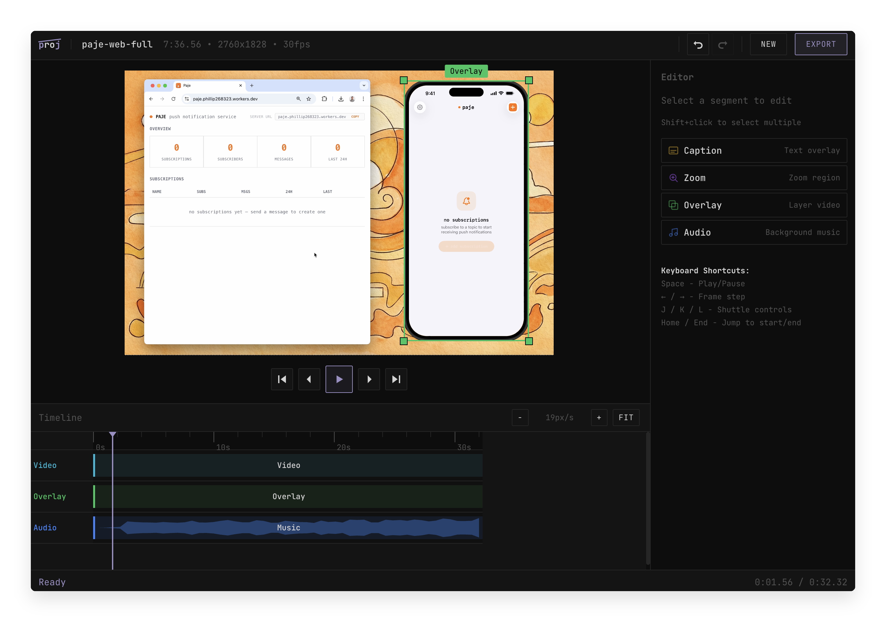

# proj

Local-first video editor that runs in your browser, powered by FFmpeg.

<p align="center">
  
</p>

## What is proj?

proj is a self-hosted video editor. Upload a video, edit it in a browser-based timeline, and export the result. All processing happens locally on your machine via FFmpeg — no cloud services, no uploads to third parties, no watermarks.

- **Timeline editing**: cut, split, trim, reorder video segments
- **Speed control**: slow down or speed up clips (0.25x to 10x)
- **Zoom effects**: animated zoom-in/out on any region with smoothstep easing
- **Text captions**: styled text overlays with positioning and background controls
- **Video overlays**: layer a second video on top, with optional iPhone device frame
- **Audio track**: add background music with volume, fade in/out, and per-segment mute
- **Aspect ratios**: export as source, 16:9, 9:16, 1:1, or 4:5
- **Export presets**: source resolution, 1080p, 720p, 480p with quality tiers (CRF 12/18/24)
- **Keyboard shortcuts**: Space, J/K/L, arrow keys, Home/End

## Getting Started

### Prerequisites

- [Bun](https://bun.sh/) 1.0+
- [FFmpeg](https://ffmpeg.org/) installed and in your PATH

### Install and run

```bash
git clone https://github.com/jonesphillip/proj.git
cd proj
bun install
bun run dev
```

This starts the server at `http://localhost:3001` and the web UI at `http://localhost:5173`.

Open `http://localhost:5173`, upload a video, and start editing.

## How It Works

### Architecture

| Component | Stack | Purpose |
|-----------|-------|---------|
| **Web UI** | React, Zustand, Tailwind, Vite | Timeline editor, preview, controls |
| **Server** | Bun, Hono, FFmpeg | File handling, video processing, project storage |

### Edit format

All edits are stored as JSON. A project file contains the source video metadata, a timeline with tracks (video, caption, effect, overlay, audio), export settings, and references to overlay/audio sources. The editor never modifies your source video — it builds a description of the edit, and FFmpeg applies it on export.

```
data/
├── projects/        # Project JSON files + index.json
├── uploads/         # Source videos + proxy files
├── thumbnails/      # Generated thumbnails
├── exports/         # Exported videos
└── temp/            # Intermediate files during export
```

### Export pipeline

When you hit Export, the server translates the project JSON into an FFmpeg filter chain:

1. **Trim + speed + scale**: concatenate video segments with speed adjustments, scale to target resolution
2. **Zoom effects**: apply animated crop+scale via zoompan filter (separate pass)
3. **Video overlays**: composite overlay videos with optional device frame
4. **Captions**: render text to PNG with rounded corners, composite via overlay filter
5. **Audio mix**: combine source audio with background music tracks

Each step is a separate FFmpeg invocation that feeds into the next. The final output is an MP4 with H.264 video and AAC audio.

## Agent Skills

All edits (cuts, speed changes, captions, overlays, audio) are stored as JSON. Projects live at `data/projects/{id}.json` and can be created, modified, and exported through a simple HTTP API. This means any coding agent can edit videos programmatically.

proj ships with an [Agent Skill](https://agentskills.io) at **[.claude/skills/proj-video-editing/SKILL.md](.claude/skills/proj-video-editing/SKILL.md)** that includes the full API reference, project JSON schema, all segment types, and common edit examples. Compatible with [Claude Code](https://claude.ai/code), [Cursor](https://cursor.com), [Codex](https://openai.com/index/codex), [Gemini CLI](https://geminicli.com), and [other agents that support skills](https://agentskills.io).

## Project Structure

```
packages/
├── web/                  # React frontend
│   ├── src/
│   │   ├── components/   # Editor, preview, timeline, UI components
│   │   ├── stores/       # Zustand state management
│   │   ├── hooks/        # Video playback, keyboard shortcuts
│   │   └── utils/        # Formatting helpers
│   └── public/           # Static assets, device frames
├── server/               # Bun + Hono backend
│   └── src/
│       ├── index.ts      # API routes, file serving
│       └── services/     # FFmpeg processing, project storage, image generation
├── shared/               # Shared TypeScript types
│   └── src/types/        # Project, timeline, segment, export types
└── ffmpeg/               # FFmpeg command builder
    └── src/filters/      # Filter chain construction, probe, thumbnail commands
```

## Limits

- Max upload size: 1 GB
- Export is CPU-bound. Duration depends on video length, resolution, and number of effects.

## Environment Variables

| Variable | Default | Description |
|----------|---------|-------------|
| `PORT` | `3001` | Server port |
| `CORS_ORIGIN` | `http://localhost:5173` | Allowed CORS origin |
| `FFMPEG_PATH` | `ffmpeg` | Override if ffmpeg is not in your PATH |
| `FFPROBE_PATH` | `ffprobe` | Override if ffprobe is not in your PATH |

## License

Apache 2.0
